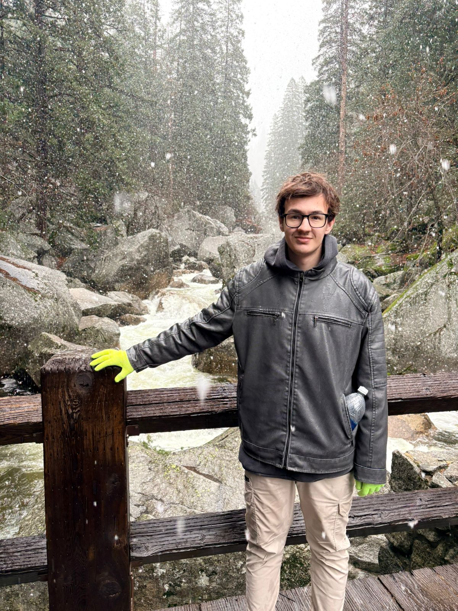

## Presentación PdeP

### Datos
- Sebastián Serpa
- 204.061-0

### Sobre mi
Soy Seba, tengo 24 años, decidí estudiar ingeniería en sistemas ya que me gusta la programación y me gustaría adquirir un dominio sólido para poder ser mas creativo y poner mis ideas en práctica de manera eficiente.
En mi tiempo libre me gusta jugar a la compu (minecraft, hollow knight o algun juego random con amigos) y tambien me gusta cocinar (Pastas, Pizza, hamburguesas, etc). Tengo 3 hermanos, una hermana y un perro muy fachero llamado Teo.

